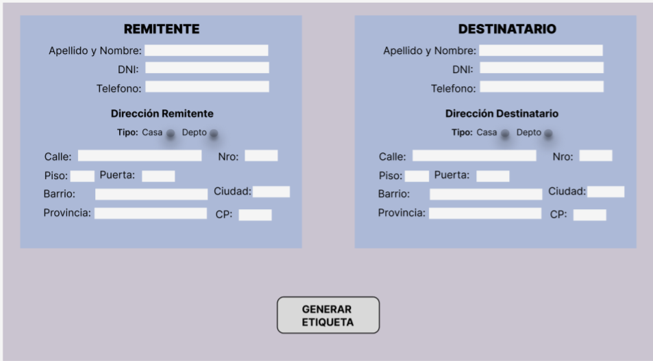
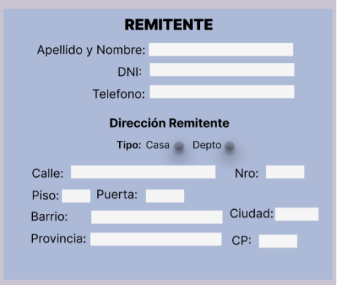
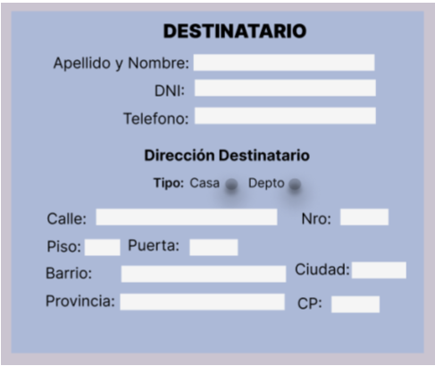

# Functional Analysis Phase 1: 
## SendUrPack Labels

### 1. Introduction
This document describes the functional analysis of the desktop system for the parcel shipping company SendUrPack. The application will allow the entry of sender and recipient data, the generation of a PDF receipt, and, in a future version, the autocomplete feature for frequent customers using a database.

### 2. System Objective
The system aims to streamline the process of generating labels for package shipments. It will enable employees to enter the necessary information and generate a printable document that will be cut and attached to the packages.

### 3. Scope
#### Desktop Version (Phase 1):
* Graphical interface developed in Python with Tkinter.
* Entry of sender and recipient data.
* Generation of a PDF receipt for printing.
* Option to autocomplete sender information using a frequent customer database.

### 4. Functional Requirements
#### 4.1 Shipment Registration Module
Allow the entry of the following data for both Sender and Recipient:
* Last Name
* First Name
* ID (DNI)
* Phone Number
* Street (Address)
* Number (Address)
* Floor (Address)
* Door (Address)
* City
* Province
* Postal Code

Generate a PDF file with this data in a predefined format for printing.

### 5. Non-Functional Requirements
* The application must be lightweight and run on Windows systems without requiring a complex installation.
* The interface must be simple and intuitive, allowing employees to operate it without extensive training.
* The PDF must be generated in a readable format, with a clear structure and an appropriate size for cutting and attaching to the package.

### 6. Usage Flow
1. The user opens the desktop application.
2. The user fills in the sender and recipient details.
3. The user clicks the “Generate Label” button.
4. A PDF is generated with the data in a predefined design.
5. The user prints and cuts the receipt.
6. The receipt is attached to the package box before shipping.

---

### Use Cases – Phase 1: Desktop Application
### Actors:
* **Company Employee:** The person using the application to generate shipping labels.
* **System:** The application that processes the data and generates the PDF.

### UC-01: Generate Shipping Label
### Description:
 The employee enters the sender and recipient details, and the system generates a PDF file for printing.
#### Main Actor:
 Company Employee.
#### Main Flow:
1. The employee opens the application.
2. The system displays a form with the required fields.
3. The employee enters the sender and recipient details.
4. The system validates that no fields are left empty.
5. The employee clicks the "Generate Label" button.
6. The system creates a PDF file with the data in the correct format.
7. The system displays a confirmation message indicating that the label was successfully generated.
8. End of use case.
#### Alternative Flow:
 4a. If any field is empty, the system displays an error message: "Fields cannot be left empty" and does not generate the PDF.

### Actors
| Actor    | Description                                                                                             |
|----------|---------------------------------------------------------------------------------------------------------|
| Employee | The employee enters the sender and recipient details, and the system generates a PDF file for printing. |

| USE CASE    | UC-01 GENERATE SHIPPING LABEL                                    |
|-------------|------------------------------------------------------------------|
| Type        | Primary, Essential                                               |
| Description | The system must allow the user to generate a PDF shipping label. |
| Actor       | Employee, user                                                   |
| Detail:     | The user opens the application, fills out the form with the required data, and generates a PDF document called "Shipping Labels."|

### Normal Flow
| User                                                     | System                                                                                          |
|----------------------------------------------------------|-------------------------------------------------------------------------------------------------|
| 1. The user starts/opens the application.                |                                                                                                 |
|                                                          | 2. The application starts/opens correctly.                                                      |
| 3. The user enters the required data in the form.        |                                                                                                 |
| 4. The user clicks the "Generate Shipping Label" button. |                                                                                                 |
|                                                          | 5. The system verifies the entered data and ensures that no field is empty.                     |
|                                                          | 6. The system validates the entered data.                                                       |
|                                                          | 7. The system generates the PDF document and stores it in a local folder named Shipping Labels. |
|                                                          | 8. The system instantly opens the document for printing.                                        |

### Alternative Flow
| User                                                     | System                                                                                          |
|----------------------------------------------------------|-------------------------------------------------------------------------------------------------|
|1.The user starts/opens the application.                  |                                                                                                 |
|                                                          |2. The application starts/opens correctly.                                                       |
|3. The user enters the required data in the form.         |                                                                                                 |
|4. The user clicks the "Generate Shipping Label" button.  |                                                                                                 |
|                                                          |5. The system verifies the entered data and ensures that no field is empty.                      |
|                                                          |6. The system detects empty fields and displays an error message: "Fields cannot be left empty." |
|7. The user enters the data in the empty fields and clicks the "Generate Shipping Label" button again.|   |
|                                                          |8. The system validates the entered data.                                                        |
|                                                          |9. The system generates the PDF document and stores it in a local folder named Shipping Labels.  |
|                                                          |10.The system instantly opens the document for printing.                                         |

| Exception 1                                                                                   |                                                                                            |
|-----------------------------------------------------------------------------------------------|--------------------------------------------------------------------------------------------|
| Step 3: The user enters the required data in the form, leaving one or more fields incomplete. | The system displays an error message warning that "Fields cannot be left empty." (Step 5). |

### User Interface Design – Phase 1: Desktop Application 
Full-Screen Application View:

Visualization of the SENDER section:

Visualization of the RECIPIENT section:

